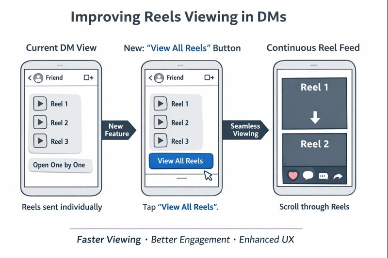

# instagram-dm-reels-ux-case-study
UX Case Study on improving Instagram Reels viewing experience in DMs
# UX Case Study: Improving Reels Viewing Experience in Instagram Direct Messages

## Overview
Instagram Reels are one of the most engaging features on the platform. A common user behavior is sharing multiple Reels with friends via Direct Messages (DMs). However, the current experience requires users to open each Reel individually, which disrupts flow and causes friction.
This case study explores a UX improvement to make Reel consumption in DMs smoother and more enjoyable.

---

## Problem Statement
When a user receives multiple Reels from the same friend in a DM conversation:
* Each Reel must be opened one by one
* There is no continuous scrolling experience
* Users must repeatedly exit and open the next Reel
This results in:
* Frustration during content consumption
* Broken engagement flow
* Increased effort for a simple, high-frequency action

---

## User Pain Points
* Repetitive taps to view each Reel
* Interrupted viewing experience
* Inefficient navigation when many Reels are shared together
This issue becomes more noticeable when friends send a large number of Reels in a short time.

---

## User Insight
Instagram users are already familiar with:
* Vertical scrolling
* Continuous Reel playback
* Gesture-based interactions
Forcing users into a different interaction model inside DMs creates unnecessary cognitive load.

---

## Proposed Solution
Introduce a **“View All Reels”** or **“Play in Sequence”** button within the DM chat when multiple Reels are shared by the same user.

### How It Works
1. User taps the “View All Reels” button
2. Reels open in a continuous vertical feed
3. Reels auto-play sequentially
4. Existing actions (like, save, share) remain available

---

## UX Flow Comparison
### Current Flow
Open Reel → Exit → Open Next Reel → Exit → Repeat

### Improved Flow
Tap once → Scroll continuously through all shared Reels

---

## Expected Impact
* Reduced interaction friction
* Improved user satisfaction
* Increased engagement with shared Reels
* Consistent experience across the app

---

## Business & Product Value
* Higher Reel completion rates
* More time spent consuming shared content
* Stronger social engagement signals
This aligns with Instagram’s core goal of maximizing engagement while keeping interactions simple.

---

## Assumptions & Constraints
* Feature activates only when multiple Reels are detected
* Works within existing Reel infrastructure
* Does not alter privacy or sharing permissions

---

## Future Enhancements
* Option to auto-play Reels shared within a specific time window
* Ability to switch between sequential and single-view mode

---

## Conclusion
This improvement focuses on reducing friction in a high-frequency social interaction. By aligning the DM Reel experience with Instagram’s core scrolling behavior, users can enjoy content more naturally and efficiently.

---

**Author:** [Ayushman Singh Rawat]
Computer Science Student | UX & Product Enthusiast
